## Dense Text-to-Image Generation with Attention Modulation
### ICCV 2023 [[Paper](https://arxiv.org/abs/2308.12964)] <br> <br>
> #### Authors &emsp;&emsp; [Yunji Kim](https://github.com/YunjiKim)<sup>1</sup>, [Jiyoung Lee](https://lee-jiyoung.github.io)<sup>1</sup>, [Jin-Hwa Kim](http://wityworks.com/)<sup>1</sup>, [Jung-Woo Ha](https://github.com/jungwoo-ha)<sup>1</sup>, [Jun-Yan Zhu](https://www.cs.cmu.edu/~junyanz/)<sup>2</sup> <br> <sub> &emsp;&emsp;&emsp;&emsp;&emsp;&emsp;&emsp;&emsp; <sup>1</sup>NAVER AI Lab, <sup>2</sup>Carnegie Mellon University </sub>

> #### Abstract
Existing text-to-image diffusion models struggle to synthesize realistic images given dense captions, where each text prompt provides a detailed description for a specific image region.
To address this, we propose DenseDiffusion, a training-free method that adapts a pre-trained text-to-image model to handle such dense captions while offering control over the scene layout.
We first analyze the relationship between generated images' layouts and the pre-trained model's intermediate attention maps.
Next,  we develop an attention modulation method that guides objects to appear in specific regions according to layout guidance.
Without requiring additional fine-tuning or datasets, we improve image generation performance given dense captions regarding both automatic and human evaluation scores.
In addition, we achieve similar-quality visual results with models specifically trained with layout conditions.


> #### Method
<p align="center">
  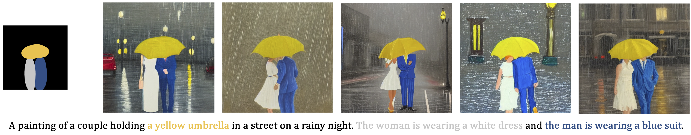</img>
</p>
<p align="center">
  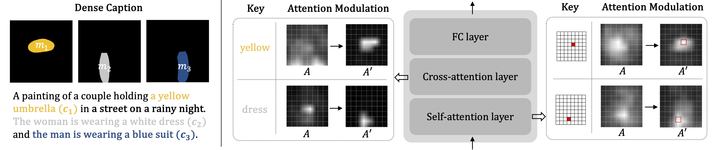</img>
</p>

Our goal is to improve the text-to-image model's ability to reflect textual and spatial conditions without fine-tuning.
We formally define our condition as a set of $N$ segments ${\lbrace(c_{n},m_{n})\rbrace}^{N}_{n=1}$, where each segment $(c_n,m_n)$ describes a single region.
Here $c_n$ is a non-overlapping part of the full-text caption $c$, and $m_n$ denotes a binary map representing each region. Given the input conditions, we modulate attention maps of all attention layers on the fly so that the object described by $c_n$ can be generated in the corresponding region $m_n$.
To maintain the pre-trained model's generation capacity, we design the modulation to consider original value range and each segment's area.


> #### Examples

<p align="center">
  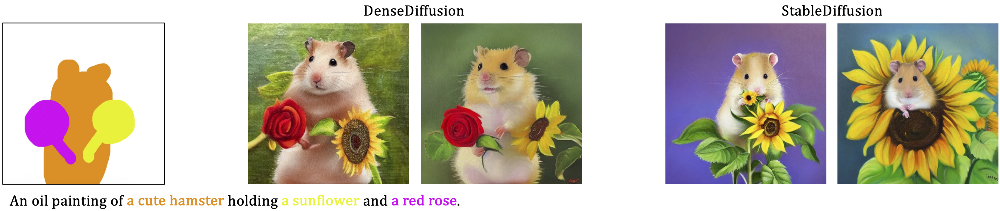</img>
</p>

<p align="center">
  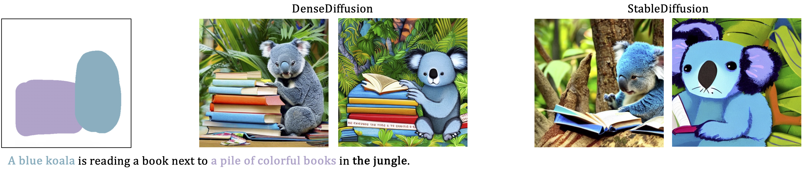</img>
</p>

<p align="center">
  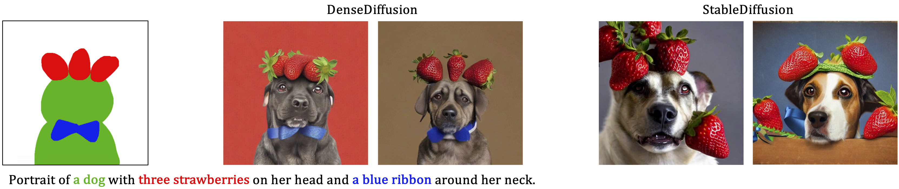</img>
</p>


----

### How to launch a web interface

- Put your access token to Hugging Face Hub [here](./gradio_app.py#L77).

- Run the Gradio app.
```
python gradio_app.py
```

----

### Web Demo

- **Colab Version** [](https://colab.research.google.com/github/XandrChris/DenseDiffusionColab/blob/main/DenseDiffusionColab.ipynb)
- The Colab Version is available at [DenseDiffusionColab](https://gihub.com/XandrChris/DenseDiffusionColab)


----


### Getting Started

- Create the image layout.
<p align="left">
  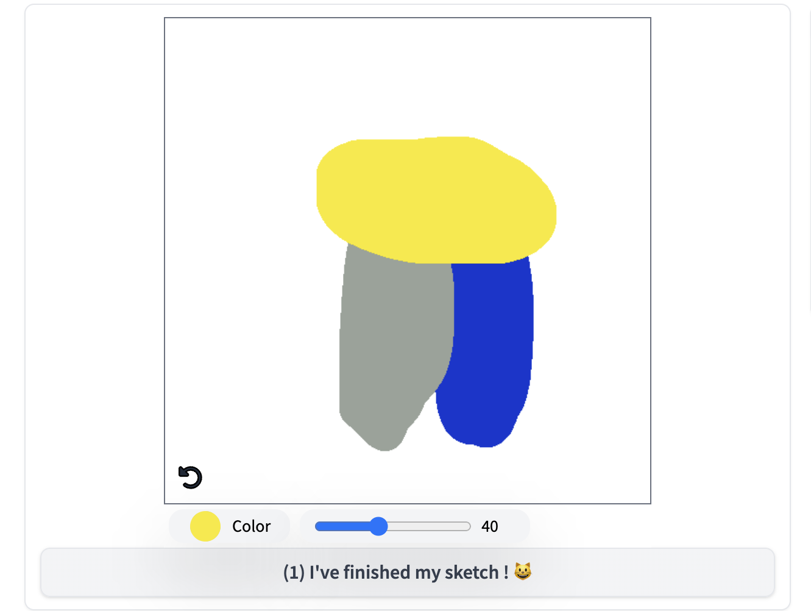</img>
</p>

- Label each segment with a text prompt.
<p align="left">
  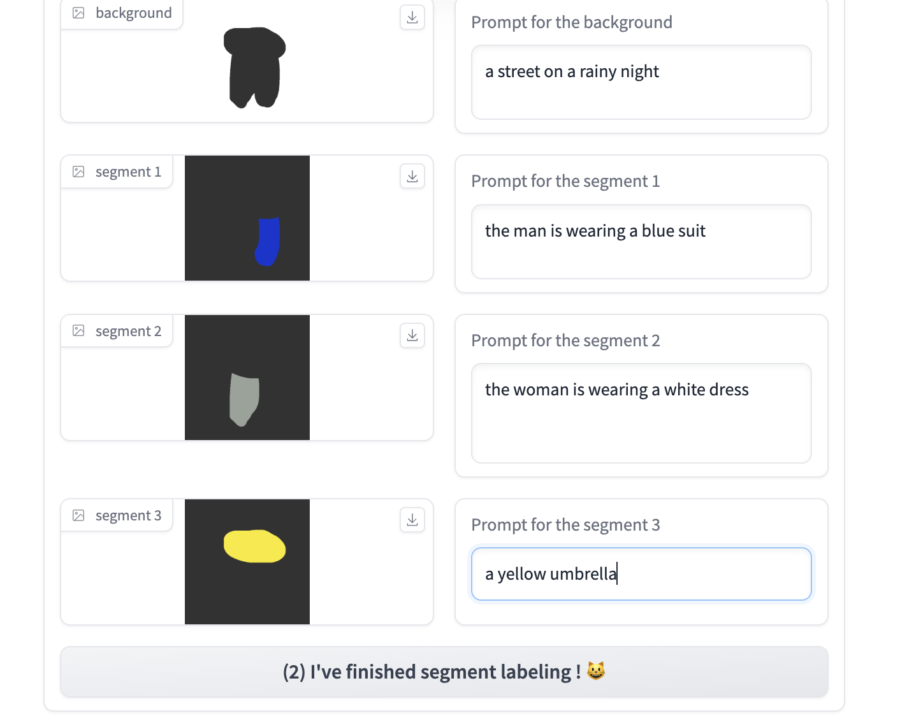</img>
</p>

- Adjust the full text. The default full text is automatically concatenated from each segment's text.  The default one works well, but refineing the full text will further improve the result.
<p align="left">
  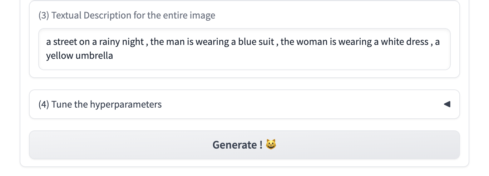  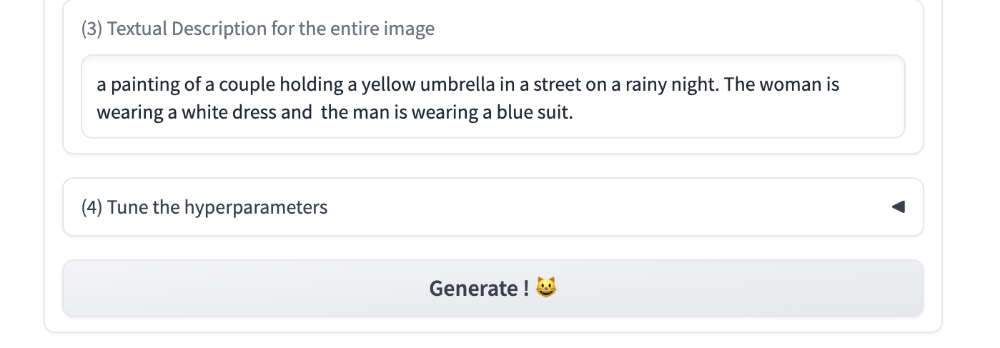
</p>

- Check the generated images, and tune the hyperparameters if needed.<br>
  w<sup>c</sup> : The degree of attention modulation at cross-attention layers. <br>
  w<sup>s</sup> : The degree of attention modulation at self-attention layers. <br>

<p align="left">
  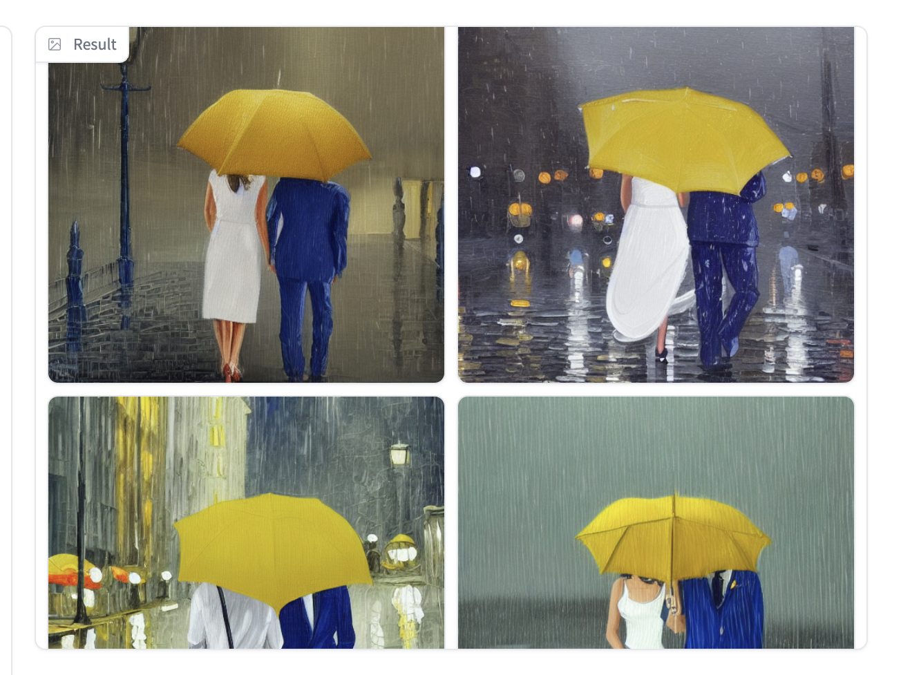  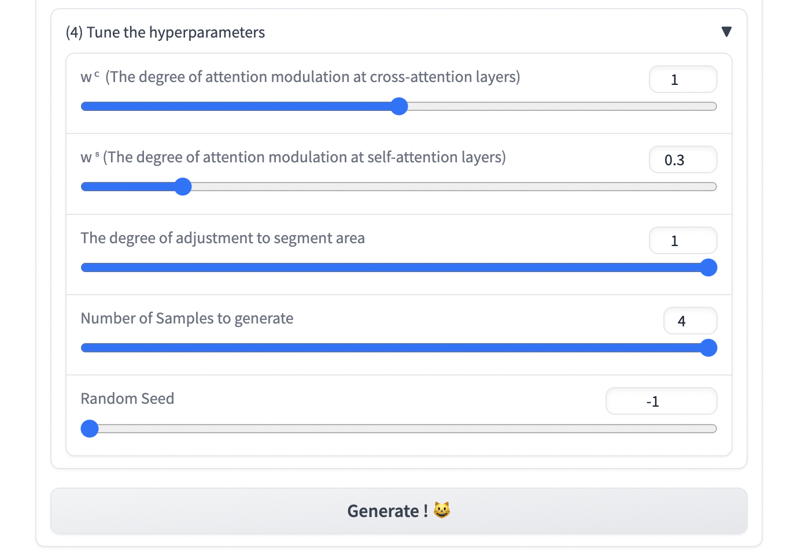
</p>

----


### Benchmark

We share the benchmark used in our model development and evaluation [here](./dataset).
The code for preprocessing segment conditions is in [here](./inference.ipynb).

---

#### BibTeX
```
@inproceedings{densediffusion,
  title={Dense Text-to-Image Generation with Attention Modulation},
  author={Kim, Yunji and Lee, Jiyoung and Kim, Jin-Hwa and Ha, Jung-Woo and Zhu, Jun-Yan},
  year={2023},
  booktitle = {ICCV}
}
```

---

#### Acknowledgment
The demo was developed referencing this [source code](https://huggingface.co/spaces/weizmannscience/multidiffusion-region-based). Thanks for the inspiring work! 🙏 

